# STA141 COURSE PROJECT 
Priyanshi Singh 
3/17/2025

# Abstract 
Neural activity plays a crucial role in decision-making, particularly in processing sensory information to guide behavior. This study analyzes neural spike data from 4 mice across 18 experimental sessions in a visual discrimination task. By examining the relationship between contrast levels, neural responses, and trial outcomes, we aim to identify predictive neural patterns. Through exploratory data analysis, data integration, and machine learning, we investigate how neural activity influences decision-making and assess the role of different brain regions in perceptual processing.

# Introduction
Perceptual decision-making is a fundamental cognitive process where sensory information is integrated to guide behavior. In visual discrimination tasks, the brain processes contrasting stimuli and generates motor responses based on perceived differences. Understanding the neural mechanisms underlying these decisions is crucial in neuroscience.

This project analyzes neural activity recorded from mice performing a contrast-based decision-making task, using a subset of data from Steinmetz et al. (2019). The dataset includes neural spike trains from four mice across 18 sessions, where mice viewed visual stimuli on two screens and used a wheel to indicate their decision. The contrast levels of the stimuli varied, and mice received feedback (success or failure) based on their responses. Neural activity was recorded from different brain regions, particularly the visual cortex, to examine how neural signals correlate with decision-making.

Our objective is to build a predictive model that determines trial outcomes based on neural activity. The analysis will follow three key phases:

- **Exploratory Data Analysis (EDA)** – Investigating dataset structure, neural activity patterns, and behavioral responses.
-  **Data Integration** – Combining trial data across sessions to construct a unified dataset.
-  **Predictive Modeling** – Using statistical and machine learning techniques to predict trial success based on spike train data and contrast asymmetry.

By identifying neural patterns that differentiate successful and unsuccessful trials, we aim to assess the predictive power of neural activity in decision-making. This study contributes to a deeper understanding of how sensory information is encoded and used by the brain to guide behavior.

# Exploratory Data Analysis
Looking at the features of the datasets for each mice, there are 6 variables for each trial:

-  **feedback_type**: This variable stores the behavioral outcome of each trial, where 1 represents success (the mouse steers toward the lower contrast side or holds the wheel steady when contrasts are equal) and -1 represents failure
-  **contrast_left**: This variable correlates to the contrast level of the stimulus presented in the left visual field, with possible values of 0, 0.25, 0.5, and 1.
-  **contrast_right**: This variable also correlates to the contrast level of the stimulus presented in the right visual field, with the same possible values as contrast_left.
-  **time**: The time bin within a trial during which the spike counts were recorded
-  **spks**: The spike count recorded from neurons within the visual cortex and associated brain regions during a given time bin
-  **brain_area**: The brain region from which the recorded neuron is located. The dataset includes multiple regions, such as ACA, CA3, DG, LS, MOs, root, SUB, and VISp.

### Summary of the Data Sessions

In the table below, we get a basic overview of each of the trial sessions. The mouse_name column and the date_exp column correspond to the dates that the mice went through the session. The num_trial variable corresponds to the amount on trials the mouse went through per session and this number varies from session to session, and from mouse to mouse. The num_neurons column corresponds to the total number of recorded neurons active per session, per mouse. The num_brain_areas variable is the number of unique brain areas recorded per session for each mouse. The last two variables, num_feedback_types and num_stimuli_conditions are constant and stay at values of 2 and 4 correctly as there are only 2 types of feedback each session can have (a 1 for success or a -1 for failure) and only 4 possible stimuli conditions across all sessions (0, 0.25, 0.5, 1).

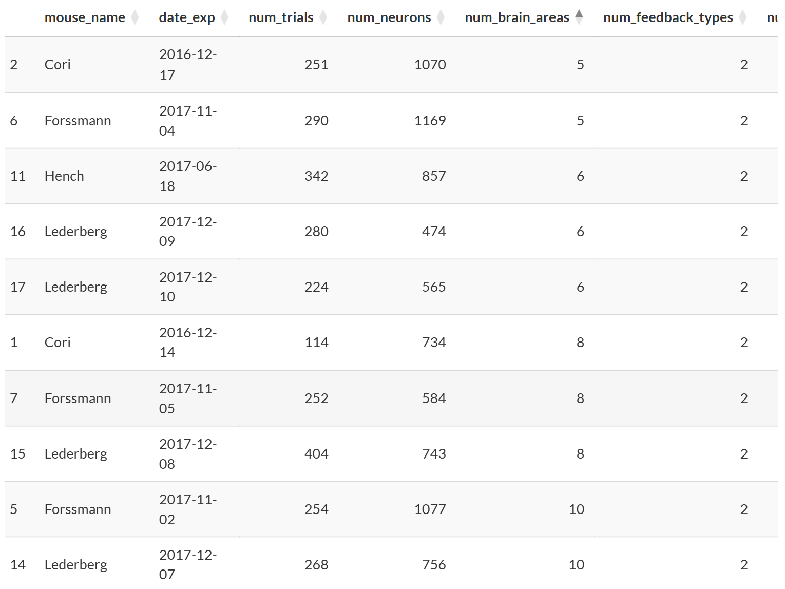

### Data Structure Plots

Furthermore, the plots below illustrate the variability in the number of trials, recorded neurons, and activated brain areas across sessions and mice.

The first plot shows the number of trials per session. Notably, the mouse Lederberg has significantly more sessions—and therefore more trials—than the other mice, which could introduce bias into the model. Cori appears to have the least amount of trials, which is also important to recognize within for the model. The second plot examines the number of recorded neurons per session. While most sessions fall within a similar range, session 4 for Forssmann stands out with a substantially higher neuron count. This may be an outlier and should be considered when building the model. Additionally, Lederberg’s larger number of sessions suggests he also has more neurons recorded overall. The final plot visualizes the number of brain areas activated per session. Cori and Forssmann appear to have fewer recorded brain areas compared to Hench and Lederberg. However, Lederberg’s increased session count likely contributes to his higher number of recorded brain areas. Also, Hench seems to have a higher number of brain areas recorded comparatively throughout his sessions while the other mice seem to fluctuate more.

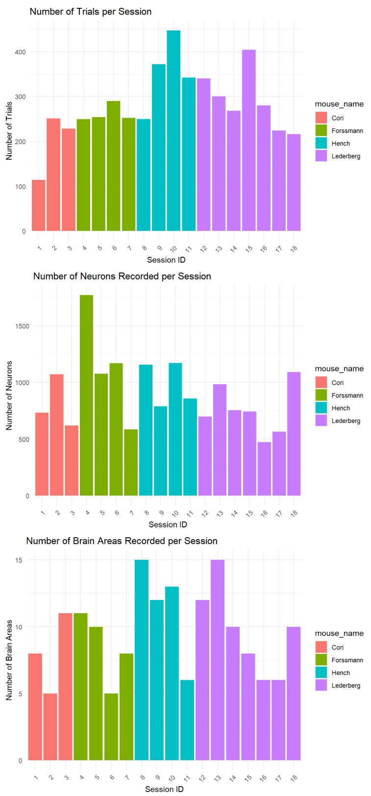

### Stimulus Conditions Analysis

The following plots illustrate the frequency and success rates of different stimulus contrast combinations across all mice. To interpret these plots, note that each point represents a specific contrast pair tested during the experiment, and the size of the blue circles indicates the number of successful trials for that contrast combination. Larger circles correspond to higher success rates.

A key observation is that the 0-0 contrast condition (where the mouse kept the wheel centered) was the most successful across all mice. Additionally, mice generally performed better when the contrast difference between the left and right visual fields was greater. For instance, Lederberg, who has the most trials, shows a clear pattern where success rates are lower when contrast values are similar (e.g., 0.25 vs. 0.5) and higher when contrast differences are more pronounced. This trend is consistent across all mice.

Interestingly, Cori appears to have a more evenly distributed success rate across contrast conditions, though this may be influenced by having fewer trials overall compared to other mice.

The count plot further confirms that the 0-0 stimulus was tested most frequently, as expected for a neutral baseline condition. The second most common stimulus combination was right contrast = 0.25 and left contrast = 1.0, which was tested significantly more than other contrast pairs. This imbalance in stimulus distribution could introduce potential biases in the predictive model, which should be considered in further analysis.

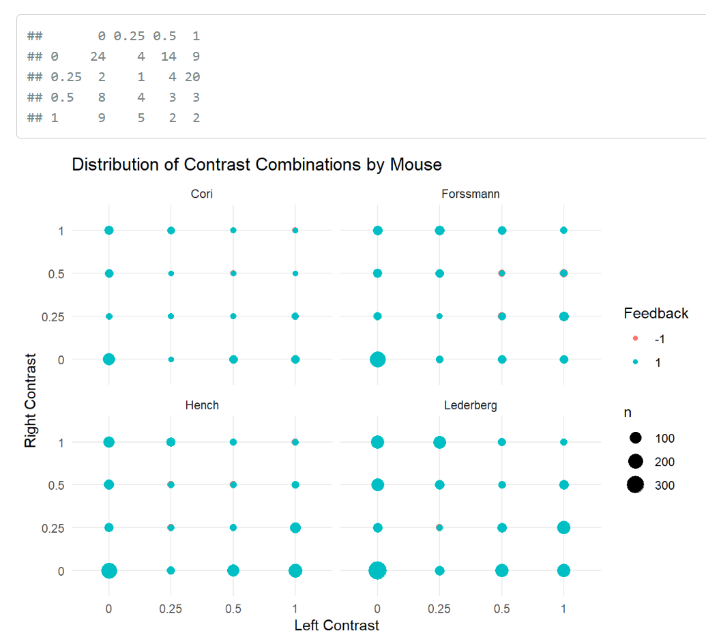

### Feedback Analysis

The plot below illustrates the consistency of success rates across mice. In general, Cori exhibited the least consistent success and the lowest average success, followed by Forssmann, Hench, and finally Lederberg, who had the most stable performance. However, it is important to note that Lederberg had the highest number of trials, while Cori had the fewest. Additionally, Cori and Hench showed an overall improvement in success rates over time, whereas Forssmann and Lederberg demonstrated more fluctuation throughout the sessions but had higher success rates.

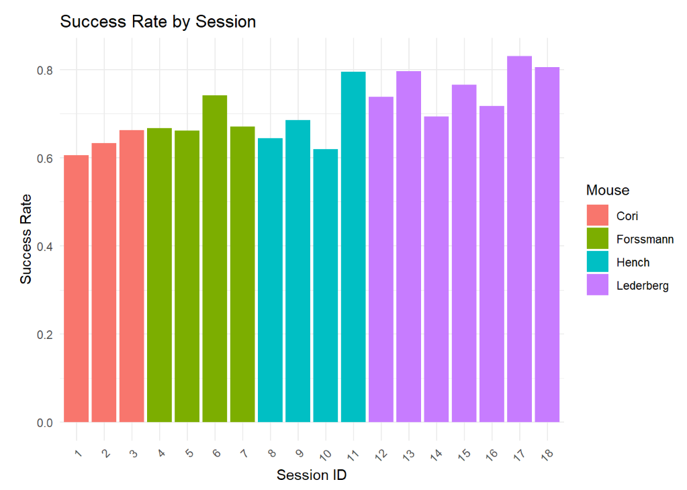

### Neural Activity Analysis

This plot displays spike rates by brain area, colored according to whether the session was successful. There isn’t a clear, distinct pattern linking specific brain areas to success, suggesting that decision-making likely involves multiple regions rather than a single area. While there are several outliers, one notable observation is the high spike rate in the RN area, which also shows a relatively good trial outcome. Other areas with higher average trial outcomes include CA1, LSr, PO, RN, SCs, and SB. These areas may play a key role in predicting session outcomes and could be important for model development.

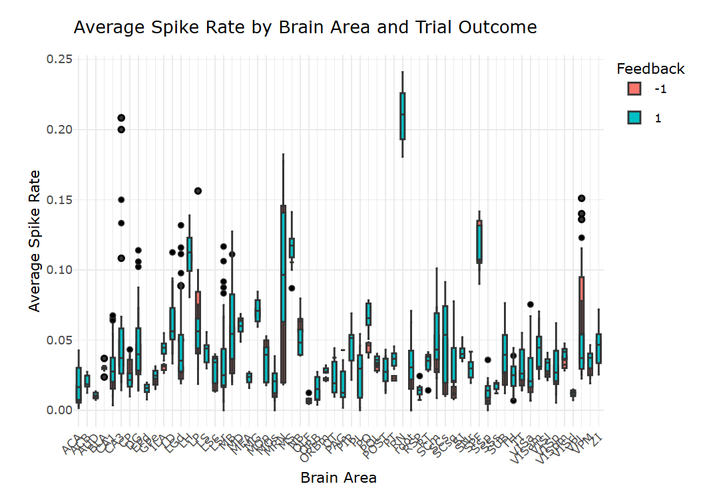

### Mouse-to-Mouse Variation

This plot illustrates the differences in neural responses across mice, helping to identify whether certain mice consistently show higher activity in specific brain regions. Although the pattern is not immediately clear, it appears that Cori and Lederberg exhibit more neural activity across regions compared to Forssman and Hench, as indicated by more frequent and higher intensity red and purple spikes in the plot. This could be influenced by factors such as insert factors here. Interestingly, Hench shows more activity in certain regions, such as VISrl. This analysis accounts for individual variation among the mice to determine if naturally higher activity levels might influence their performance in stimulus success outcomes.

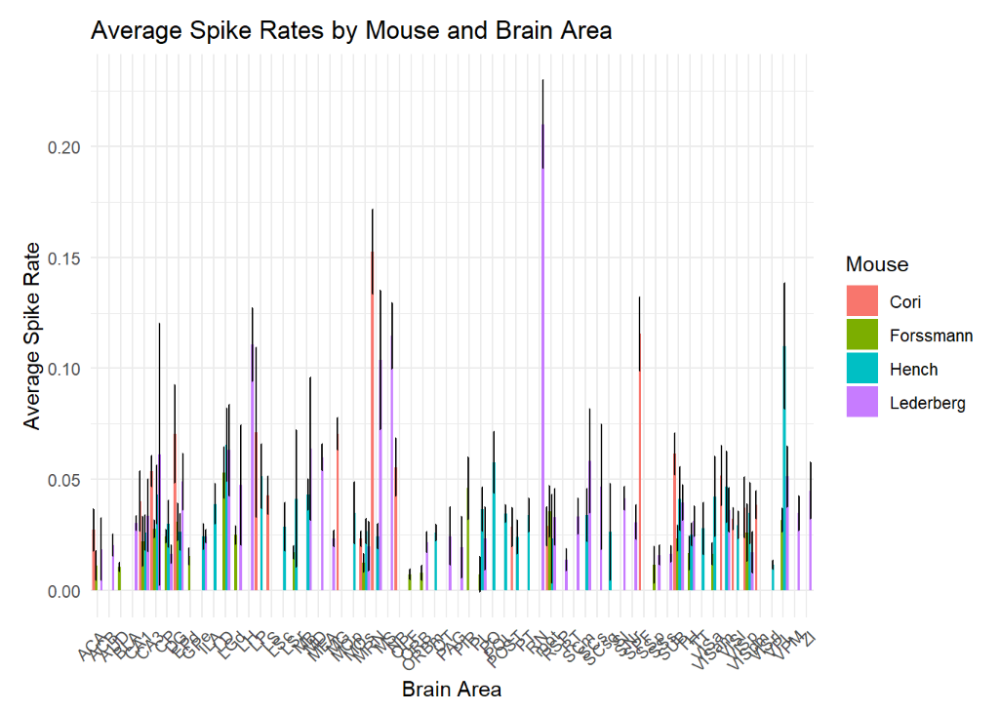

### Stimuli and Success Rate

The heatmap below displays the success rates based on the contrast combinations of stimuli. From this heatmap, we can observe that the combinations with the highest success rates are those with larger contrast differences, which mirrors the findings from the stimulus condition analysis plot. For example, combinations such as 0.5 & 0, 1 & 0, and 0.25 & 1 all have success rates ranging from 0.7 to 0.85. In contrast, combinations with smaller contrast differences, such as 0.5 & 0.25, show a lower success rate of around 0.63, regardless of whether the higher contrast is on the left or right side. This suggests that a greater difference between contrasts leads to a higher success rate in mice.

An interesting pattern observed in the heatmap is that mice tend to have a higher success rate when the higher contrast is presented on the left side, rather than the right. For instance, when the left stimulus is set to 1 and the right stimulus is set to 0, the success rate is 0.84, while the inverse (left at 0 and right at 1) results in a success rate of 0.75. This difference highlights an interesting trend in how contrast orientation may affect the mice’s ability to succeed in the task.

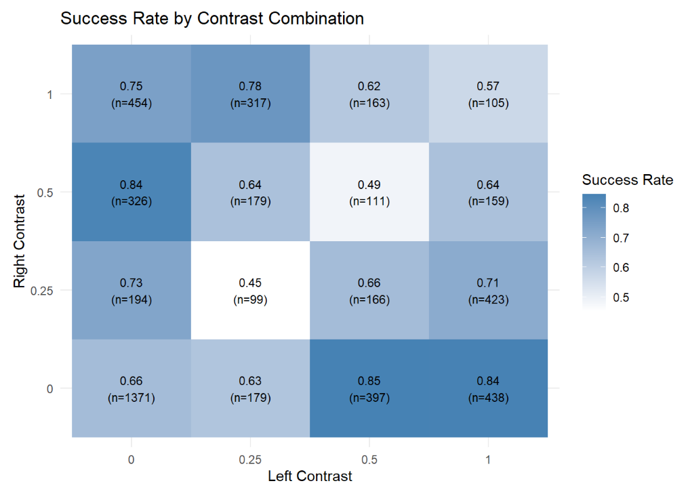

## Overview of EDA

The EDA examines the behavioral and neural data from the mice, focusing on key variables such as trial feedback, contrast conditions, spike counts, and brain areas. Based on all the above plots and tables, we made a few key insights regarding the data:

- Session Summary: Mouse trial counts, recorded neurons, and activated brain areas varied across sessions. Lederberg had the most trials, while Cori had the fewest, which could lead to bias in modeling.
- Data Structure Plots: The number of trials, neurons, and brain areas across sessions showed variability, highlighting potential data imbalances, particularly for Lederberg.
- Stimulus Conditions: Larger contrast differences between the left and right visual fields led to higher success rates. The 0-0 contrast condition was the most successful overall.
- Feedback: Cori showed inconsistent success but improved, while Lederberg’s performance was fluctuating but the highest. This indicates variability in task consistency among the mice.
- Neural Activity: No single brain region was strongly linked to success, suggesting that multiple brain areas contribute to decision-making.
- Mouse-to-Mouse Variation: Neural responses varied across mice, with some regions showing more activity, which could influence success rates.
- Stimulus & Success Rate: Higher contrast differences, especially with the higher contrast on the left, correlated with better success rates.

For our next steps, we will use these key findings to combine data from multiple sessions, addressing variations in trials, neurons, and brain areas.

# Data Integration

### Considerations from EDA

As we move into the data integration part of this project, we combine data across trials that effectively extracts shared patterns while addressing the differences between sessions. As seen in the EDA section above, there are several considerations to keep in mind when building the model that must be addressed in the integration process. First, there is significant variance in the number of trials across mice, with Lederberg having substantially more trials than Cori, which could result in a bias in our model toward patterns observed in mice with more data. The second consideration being the distribution of contrast combinations varies across sessions, with some configurations being tested more frequently than others. Third, different brain areas were recorded across sessions and mice, making it difficult to create consistent neural features.

Despite these challenges, in the EDA, we also found several consistent patterns that can be leveraged for prediction such as the pattern between larger contrast differences and how that typically leads to higher success rates, a certain configuration with higher left contrast outperforms that with higher right contrast, and that the 0-0 contrast condition shows particularly high success rates.

### Feature Engineering

To address these considerations and challenges, when building my model, I engineered some features and tried to:

- Extract shared patterns accross sessions that were more visibly extractable and obvious such as the contrast difference correlations, and the 0-0 constrast condition indicator. This was done by getting the absolute value difference between the left anr right constrasts, and capturing the directional effect for the left or right higher constrast case

- I also addressed differences between sessions by weighting trial with respect to the mouse’s trial counts, the mouse-specific performing metrics, and the trial progression features to account for the differences in trial counts accross the micee and the variations across mice. This was done by taking into account the mouses’s average success to create a baseline performance measure for each mouse, and then capture any learning effects within the mouse as seen through progressions of each trial. I also took into account any inter-session patterns and the disbalanced trial counts per mouse by assigning trial weights that were inversely relational to the mice’s trial counts (so the more trials a mouse has, the less weight it has to minimize skew).

### Interpretations of Results

Based on the visualizations seen below in the drop-down menu, we can see that the integrated dataset still maintains the key relationships and patterns seen during EDA.

The first table suggests that the contrast difference variable indeed has the strongest correlation with the trial outcome with a coefficient of 0.139, closely followed by the session progression coefficient of 0.138. Furthermore, the left-higher indicator of 0.073 shows a stronger correlation to the trial outcomes than the right-higher indicator of 0.053, confirming the asymmetric effect observed in the EDA.

The next plot shows the right versus left contrast effect. Almost all mice, with the exception of Forssman, show that there is a higher success rate when the left contrast is more than the right contrast. For example, Cori shows around a 75% success rate for left-high simulations compared to his 58% right-higher simulations.

The next image visualizes the relatiionship between the contrast diffeence and the success rate, which is preserved as larger differences in the contrast lead to higher success rates. However, it is to be noted that Lederberg has the strongest performance across all the different constrast differences where as Cori and Hench have a little more variability.

The fourth image is a plot describing the right-zero conditions suggesting that the simulations in which the right side is 0 and the left side is more than 0, have the highest success rates of around 80%. This follows our first observation and visualization where we observed that there seems to be a higher success rate when the left contrast is more than the right contrast. The next “most successful” configuration is when the left is 0, also support the idea that the higher the difference of contrast, the higher the success rate typically is. Both of these conditions do better than the condition in which both the stimulus are 0 or both of them are more than 0, which further reinforces the idea that the larger contrast difference is important and highlights the importance of this configuration not previously noticed.

The last visualization shows the variability in the learning patterns across the mice, with some mice like Lederberg impriving overtime and others have more fluctaion. This means that using the weighting approach will be good to ensure that these patterns are accounted for when developing the predictive model despite the trial count imbalances.

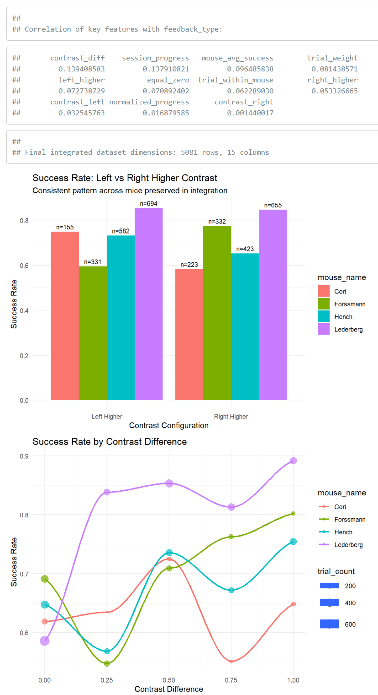
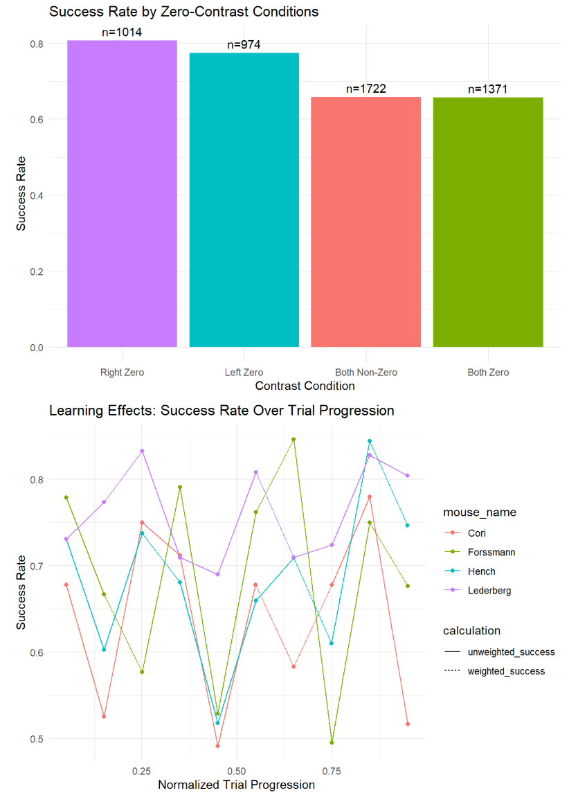

# Predictive Modeling

### Process

Building on the integrated dataset that successfully combines information across all 18 sessions, we now proceed to the final phase of our analysis which is developing a predictive model for trial outcomes.

As seen above, our data integration approach preserved the key patterns identified in the EDA; particularly the contrast difference effect, left-higher advantage, and mouse-specific performance variations—while addressing the challenges of imbalanced trial counts and session-specific differences. By leveraging this unified dataset and its relevant and carefully engineered features and trial weighting strategy, we can build an effective prediction model that can leverage information across all sessions to accurately classify trial outcomes.

### Interpretations

Based on the visualizations provided in the drop down menu below, we can see some key features on each.

In the first image, we can see that session progression emerged as the most influential predictor by a large mergin, followed by contrast difference and mouse-specific factors (particularly Lederberg). This suggests that learning effects play a more significant role in trial outcomes than initially anticipated. The relatively low importance of the left_higher and right_higher indicators, despite their correlation with outcomes in the EDA, suggests that these effects are captured more effectively by other features in the model.

The second image is about the contrast dependent accuracy in which we can see that there is a clear positive relationship with contrast difference, increasing from approximately 65% at zero difference to nearly 85% at maximum difference. This confirms our EDA finding that larger contrast differences facilitate more consistent decision-making in mice, likely by providing clearer sensory signals for discrimination.

The third image records the mouse-sepcfic performance patterns in which prediction accuracy varies significantly across mice, with Lederberg showing the highest accuracy (80%) and Cori the lowest (68%). This aligns with our EDA observation that Lederberg exhibited more stable performance throughout the experiment. The sample sizes for each mouse (n=405 for Lederberg vs. n=114 for Cori) reflect the trial count imbalance identified in our data integration phase.

The last image shows the left-right constrast symmetry pattern in which we can see that the model has a higher accuracy on trials where the left contrast exceeds the right contrast (80.5% vs. 70.6%), providing further evidence for a lateral bias in visual processing. This asymmetry, consistently observed across our analyses, suggests a fundamental aspect of how mice process visual information in this decision-making task.

### Conclusion

The Random Forest model’s overall accuracy of 74.2% demonstrates that our integrated dataset effectively captures the key patterns in mouse decision-making. However, the model’s lower recall for failure cases (16.7%) indicates that predicting unsuccessful trials remains challenging, possibly because these failures arise from more complicated patterns not fully captured by our current feature st.

These results not only validate the patterns identified in our exploratory analysis but also provide solidified evidence for the relative importance of different factors in driving trial outcomes. Surprisingly, the prevalence of session progression in feature importance highlights the inherent nature of decision-making, with mice continually adapting their strategies throughout the experiment.

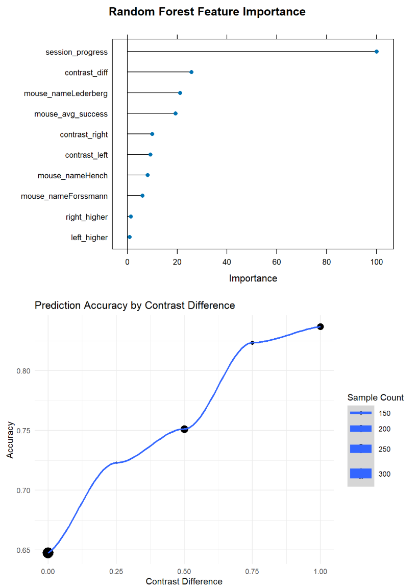
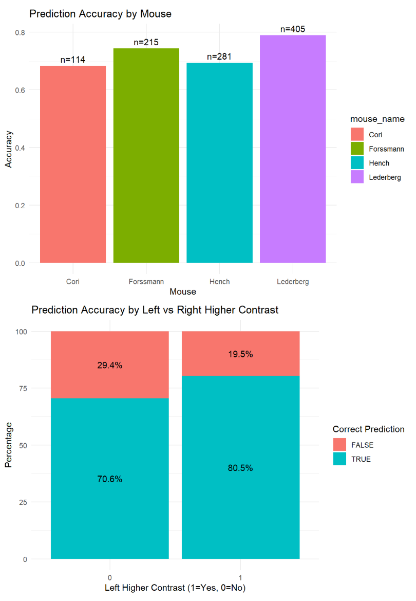

# Next Steps

The next steps of this project would be to test the prediction performance of our model.

